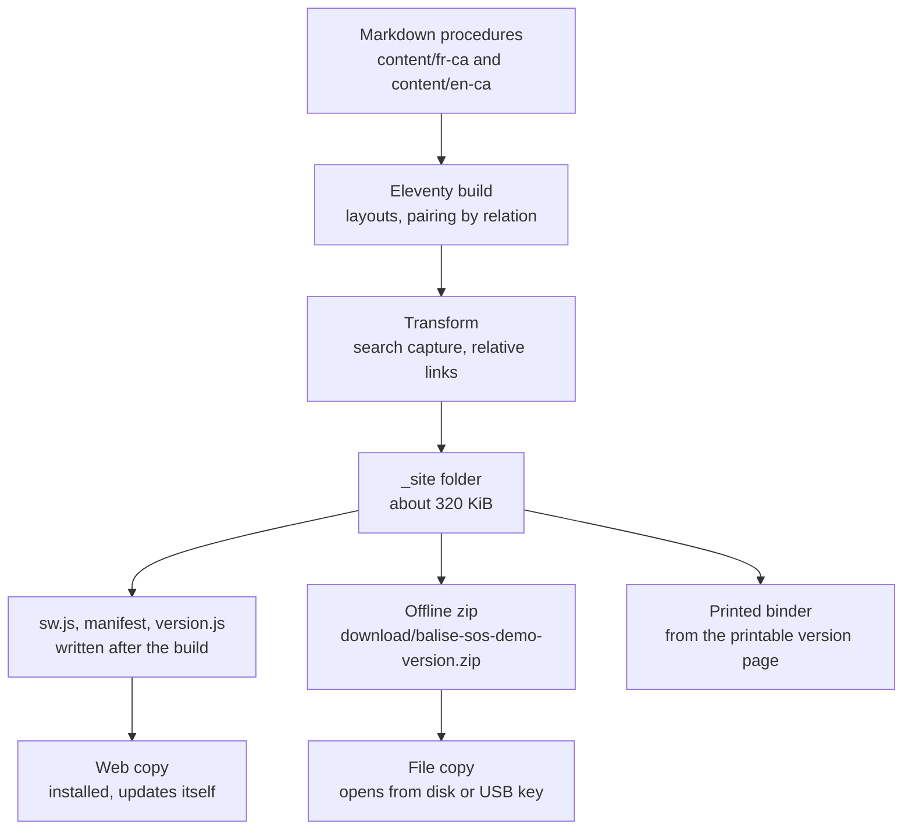

# Overview: How Balise Works

Version: 0.1.1
Status: Draft
Style Guide: style-guide--technical-documentation-for-technologists

## Abstract

This document describes how the Balise demo works as a whole: what it is for, how content becomes a site, the two ways a copy reaches a device, and where each piece lives in the repository. It is the entry point for anyone who needs to understand the system before changing it; the decision records explain the reasons behind each part.

## Sources and Acknowledgements

The service worker and manifest follow the Mozilla Developer Network reference material ([MDN contributors, n.d.](#apa-mdn-sw-overview-reference)). The build uses Eleventy ([Eleventy, n.d.](#apa-eleventy-overview-reference)) and fflate ([Arora, n.d.](#apa-fflate-reference)).

## What Balise is

Balise, French for beacon, is a website of emergency procedures for a small municipality that keeps working when the network does not. It is the entry point of the Resilience Pack: easy to explain, quick to set up, and useful the first time a storm takes the Internet down.

The demo serves a fictional municipality, Saint-Démo-des-Neiges, with three sites (town hall, municipal garage, community centre), a six-person emergency management team, and six procedures in French and English. Every name and every 555 number is invented; only 911 and 811 are real.

## From content to copies

Text equivalent: markdown in two language folders goes through the Eleventy build, a transform captures search text and rewrites links, and the result is a folder of about 320 KiB. From that folder come three kinds of copy: a web copy that installs and updates itself, a zip that opens from disk, and a printed binder.

## Three copies, one source

**Web copy.** Served over HTTPS, today from a web container on the operator's workstation, `flow.local`, see ADR-006. The first visit stores the whole site on the device; afterwards it opens with no network and refreshes itself whenever the network returns. See ADR-002.

**File copy.** The zip, unzipped to a computer or USB key, opened by double-clicking `index.html`. Works on any browser, never evicted, never updates itself; it shows its age and can check whether a newer version exists. See ADR-002.

**Paper copy.** The "Printable version" page holds every procedure with a table of contents and page breaks, and prints with empty boxes to tick by pen. Paper is the copy that survives flat batteries.

## What a reader sees

Each page carries a demonstration notice, a navy header, the 911 line as a red band, navigation, a search box and, in the footer, an amber status line that turns red when the copy is old: which kind of copy this is, its version and build date, and a warning once it is more than 30 days old.

Each procedure shows who is responsible, when it was last reviewed and its version, then sections of steps. With JavaScript, each step is a checkbox for the current session; nothing is saved, so a shared computer keeps no trace. Without JavaScript, everything still reads, and search explains that it needs scripts.

## Repository map

| Path | Holds |
|------|-------|
| `content/` | Pages, one folder per locale, plus the bilingual entry page |
| `_includes/layouts/` | Page, procedure, list, print and search layouts on one base |
| `_data/` | Interface strings and navigation per locale |
| `_11ty/` | Build modules: site settings, link rewriting, search index, offline shell, service worker template |
| `assets/` | CSS for screen and print, the two scripts, the icon, the Atkinson Hyperlegible font |
| `scripts/` | Clean, package the zip, check the output, draw icons |
| `tests/` | Optional browser test of both offline modes |
| `en/docs/devops/balise/` | Current copies of the local web setup, starting with `deploy-local.sh` |
| `en/docs/` | This documentation: decisions, guides, process, shared house rules |

## License

This document, *Overview: How Balise Works*, by **Christopher Steel**, with AI assistance from **Claude Opus 5.5 (Anthropic)**, is licensed under the [GNU General Public License v3.0 or later](https://www.gnu.org/licenses/gpl-3.0.html).

## Resources

### Platform references

- [Service Worker API](#apa-mdn-sw-overview-reference)
- [Eleventy documentation](#apa-eleventy-overview-reference)
- [fflate](#apa-fflate-reference)

## References

Arora, A. (n.d.). *fflate* [Computer software]. GitHub. Retrieved October 6, 2026, from https://github.com/101arrowz/fflate
[Return to citation](#apa-fflate-citation)

Eleventy. (n.d.). *Eleventy documentation*. Retrieved October 6, 2026, from https://www.11ty.dev/docs/
[Return to citation](#apa-eleventy-overview-citation)

MDN contributors. (n.d.). *Service Worker API*. Mozilla. Retrieved October 6, 2026, from https://developer.mozilla.org/en-US/docs/Web/API/Service_Worker_API
[Return to citation](#apa-mdn-sw-overview-citation)

## Changelog

| Version | Status | Notes |
|---------|--------|-------|
| 0.1.1 | Draft | Web copy now served from the local web container, flow.local, per ADR-006; new look described; repository map gains en/docs/devops/balise; sizes updated. |
| 0.1.0 | Draft | Initial draft. |
