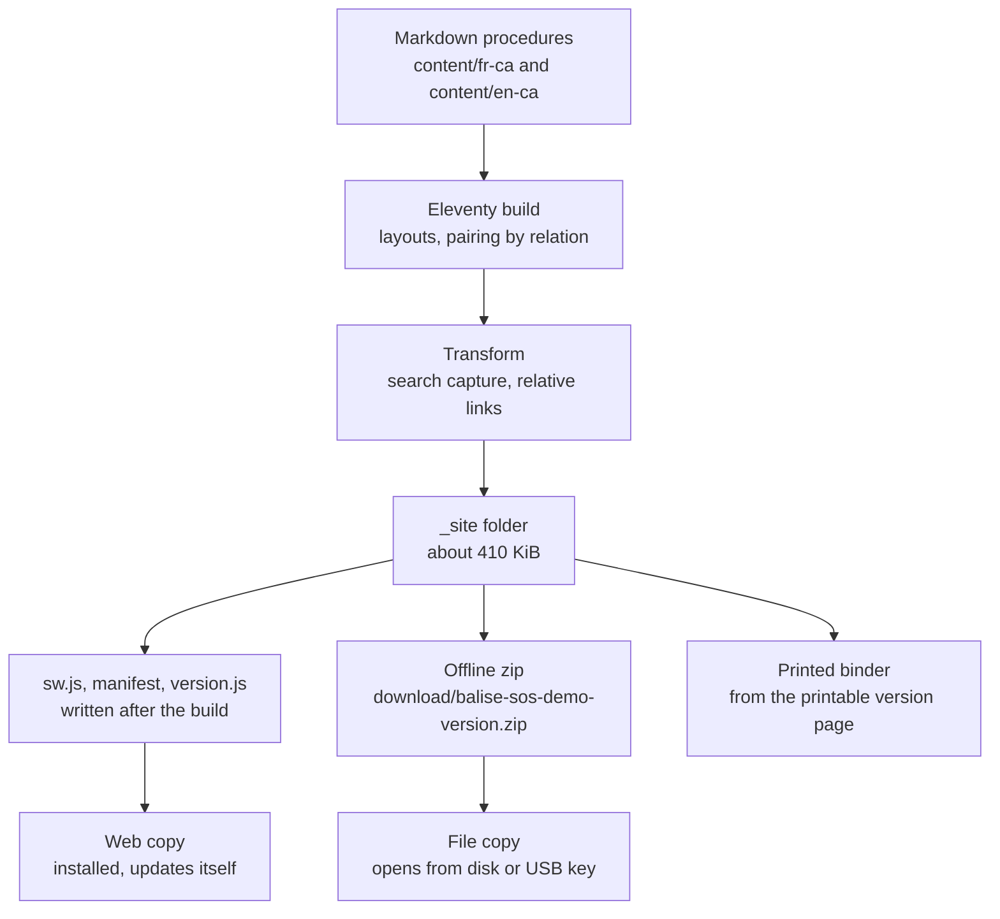

# Overview: How Balise Works

Version: 0.2.0
Status: Draft
Style Guide: style-guide--technical-documentation-for-technologists

## Abstract

This document describes how the Balise demo works as a whole: what it is for, how content becomes a site, the two ways a copy reaches a device, how each copy stays current, how the reader learns whether the network is reachable, and where each piece lives in the repository. It is the entry point for anyone who needs to understand the system before changing it; the decision records explain the reasons behind each part.

## Sources and Acknowledgements

The service worker and manifest follow the Mozilla Developer Network reference material ([MDN contributors, n.d.-b](#apa-mdn-sw-overview-reference)), as does the use of the browser's online state ([MDN contributors, n.d.-a](#apa-mdn-online-reference)). The build uses Eleventy ([Eleventy, n.d.](#apa-eleventy-overview-reference)) and fflate ([Arora, n.d.](#apa-fflate-reference)).

## What Balise is

Balise, French for beacon, is a website of emergency procedures for a small municipality that keeps working when the network does not. It is the entry point of the Resilience Pack: easy to explain, quick to set up, and useful the first time a storm takes the Internet down.

The demo serves a fictional municipality, Saint-Démo-des-Neiges, with three sites (town hall, municipal garage, community centre), a six-person emergency management team, and six procedures in French and English. Every name and every 555 number is invented; only 911 and 811 are real.

## From content to copies

Text equivalent: markdown in two language folders goes through the Eleventy build, a transform captures search text and rewrites links, and the result is a folder of about 410 KiB. From that folder come three kinds of copy: a web copy that installs and updates itself, a zip that opens from disk, and a printed binder.

## Three copies, one source

### Web copy

Served over HTTPS, today from a web container on the operator's workstation at `https://sos-flow.local/`, see ADR-006. The first visit stores the whole site on the device; afterwards it opens with no network and refreshes itself whenever the network returns. See ADR-002.

### File copy

The zip, unzipped to a computer or USB key, opened by double-clicking `index.html`. Works on any browser, never evicted, never updates itself; it shows its age and can check whether a newer version exists. See ADR-002.

### Paper copy

The "Printable version" page holds every procedure with a table of contents and page breaks, and prints with empty boxes to tick by pen. Paper is the copy that survives flat batteries.

## What a reader sees

Each page carries a demonstration notice, a navy header with the online/offline indicator and the language switch, the 911 line as a red band, navigation, a search box and, in the footer, an amber status line that turns red when the copy is old: which kind of copy this is, its version and build date, and a warning once it is more than 30 days old.

Each procedure shows who is responsible, when it was last reviewed and its version, then sections of steps. With JavaScript, each step is a checkbox for the current session; nothing is saved, so a shared computer keeps no trace. Without JavaScript, everything still reads, and search explains that it needs scripts.

The navigation offers a dropdown beside Procedures, listing every procedure, and beside Contacts and Balise, listing the sections of those pages. It follows the disclosure navigation pattern: each item stays a link to its page, and a separate button with `aria-expanded` shows or hides the list. Escape closes the open list and returns focus to its button. We chose disclosure over an ARIA `menu`, because a menu role promises application-style arrow-key behaviour that site navigation does not need and screen reader users do not expect there. Section ids come from each page's `##` headings, read from the markdown source by `_11ty/headings.js`, so a submenu link and the heading it points at cannot disagree. Without JavaScript the buttons and lists stay hidden and every page remains one link away. See *Accessibility: Features, Checks and Next Steps* in `en/docs/accessibility/`.

## How updating works

### The web copy

The service worker stores every file of the site when it installs. Its cache name contains a SHA-256 hash of every stored file, so any change to the site produces a different `sw.js`.

Pages are answered from the stored copy at once and refreshed from the network in the background. A refreshed page replaces the stored one, so the reader sees it on the next visit. A page not yet stored is fetched with a four second limit, then falls back to the home page. Other files, styles, scripts and the search index, come from the store.

A new version arrives as a new `sw.js`. The browser compares the worker script whenever a page of the site is opened with a network; Caddy sends `sw.js` with `Cache-Control: no-cache`, so the comparison is never answered from the HTTP cache. A changed worker installs in the background: it downloads every file of the new version into a new cache, and only when all of them have arrived does it take over and delete the old cache. A reader never sees a mix of two versions, and an interrupted download leaves the old version intact. "Check for updates" also asks the browser to compare the worker at once.

`version.js` is the one file never stored and never answered by the worker. It says which version the server holds, and a stored copy would answer wrongly while offline: before 0.2.0 an offline web copy reported "up to date" from its own store. Leaving it to the network makes the answer, and its failure, truthful.

We chose stored-first pages over network-first in 0.2.0. Network-first with a time limit showed the newest page to a reader on a working connection, but on a network that is up without reaching the server, a phone on Wi-Fi with no Internet route, or off the network where `.local` names cannot be found, every page waited the full four seconds. Stored-first costs one visit of staleness for an individual page, while whole-version updates, which are what matter for procedures, are unaffected. See ADR-002.

### The file copy

A downloaded copy never changes itself. "Check for updates" loads `version.js` from the public address with a `<script>` tag, which the browser allows from `file://` where `fetch()` is refused, and compares versions. A newer version is fetched by downloading the zip again.

### Age

Both copies show their version and build date in the footer, and the line turns red once the copy is older than 30 days, as a reminder to update.

The reader-facing account of all this is on the Balise page, in both languages.

## Online and offline indicator

The header carries an indicator with three states, each stated in words with a dot that only repeats it: Online, the server answered a moment ago; Offline, the device has no network or the last attempt failed; and Network not checked, the device reports a connection nobody has tried yet.

It learns from three signals, none of which costs a request of its own:

- each background page refresh the service worker does anyway reports whether the network answered, with a message to open pages, and a page that opens first asks for the last result;
- the browser's `online` and `offline` events, where `offline` is reliable and `online` triggers one check;
- a check when the reader presses the indicator, which is a button: it loads `version.js` as above.

There is no polling. The browser's online state alone was not enough: it reports a connection whenever the device has a network interface up, which is exactly the case of a phone on Wi-Fi without Internet, so it can say "offline" with confidence but never "online" ([MDN contributors, n.d.-a](#apa-mdn-online-reference)). Periodic polling was rejected for its cost in battery and data on the devices Balise is meant for. The Network Information API was rejected because Safari and Firefox do not offer it.

Changes made by the reader's own check, or by the network going away or coming back, are announced to screen readers through a polite live region; the silent update after each page load is not, so a screen reader does not repeat "online" on every page.

### Checking other services, later

The same mechanism can grow into a list of services to check on demand, such as the municipality's Microsoft 365 or the Balise server itself as a separate line. Each entry would be a name and an address, checked only when the reader asks. A page can learn only whether such a service answered, not whether it works: a cross-origin request made in `no-cors` mode, or an image load, succeeds or fails without exposing the response. Each check also tells that service the device's address and the time, so the list must be short, named on the page, and chosen by the municipality. Where a vendor offers a public status page, linking to it says more than a reachability check can.

## Repository map

| Path | Holds |
|------|-------|
| `content/` | Pages, one folder per locale, plus the bilingual entry page |
| `_includes/layouts/` | Page, procedure, list, print and search layouts on one base |
| `_data/` | Interface strings and navigation per locale |
| `_11ty/` | Build modules: site settings, link rewriting, search index, section headings, offline shell, service worker template |
| `assets/` | CSS for screen and print, the two scripts, the icon, the Atkinson Hyperlegible font |
| `scripts/` | Clean, package the zip, check the output, draw icons |
| `tests/` | Optional browser test of both offline modes, the navigation, the indicator, and axe-core accessibility checks |
| `en/docs/devops/balise/` | Current copies of the local web setup: deploy script, Caddyfile, container configuration, name publishing unit |
| `en/docs/` | This documentation: decisions, guides, process, shared house rules |

## License

This document, *Overview: How Balise Works*, by **Christopher Steel**, with AI assistance from **Claude Opus 5.5 (Anthropic)**, is licensed under the [GNU General Public License v3.0 or later](https://www.gnu.org/licenses/gpl-3.0.html).

## Resources

### Platform references

- [Navigator: onLine property](#apa-mdn-online-reference)
- [Service Worker API](#apa-mdn-sw-overview-reference)
- [Eleventy documentation](#apa-eleventy-overview-reference)
- [fflate](#apa-fflate-reference)

## References

Arora, A. (n.d.). *fflate* [Computer software]. GitHub. Retrieved October 6, 2026, from https://github.com/101arrowz/fflate
[Return to citation](#apa-fflate-citation)

Eleventy. (n.d.). *Eleventy documentation*. Retrieved October 6, 2026, from https://www.11ty.dev/docs/
[Return to citation](#apa-eleventy-overview-citation)

MDN contributors. (n.d.-a). *Navigator: onLine property*. Mozilla. Retrieved October 7, 2026, from https://developer.mozilla.org/en-US/docs/Web/API/Navigator/onLine
[Return to citation](#apa-mdn-online-citation)

MDN contributors. (n.d.-b). *Service Worker API*. Mozilla. Retrieved October 6, 2026, from https://developer.mozilla.org/en-US/docs/Web/API/Service_Worker_API
[Return to citation](#apa-mdn-sw-overview-citation)

## Changelog

| Version | Status | Notes |
|---------|--------|-------|
| 0.2.0 | Draft | Added how updating works, the online/offline indicator with a design for checking other services later, and the navigation submenus; version.js no longer stored; sizes, address and repository map updated; bold labels in Three copies replaced by headings. |
| 0.1.1 | Draft | Web copy now served from the local web container, flow.local, per ADR-006; new look described; repository map gains en/docs/devops/balise; sizes updated. |
| 0.1.0 | Draft | Initial draft. |
