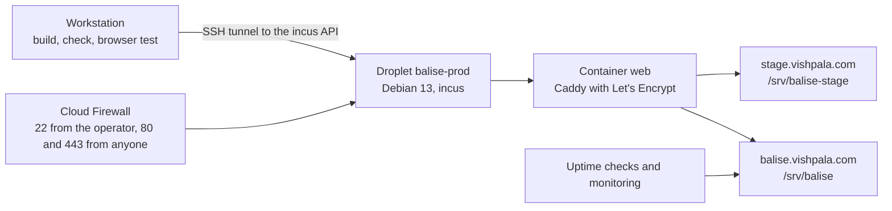

# Migration Guide: Balise and Its Testing on a Production DigitalOcean Droplet

Version: 0.1.0
Status: Draft
Style Guide: style-guide--technical-documentation-for-technologists

## Abstract

This guide describes how to move the Balise web copy from the incus container on the operator's workstation to a production DigitalOcean droplet, and how its testing moves with it. The droplet runs incus with one web container whose Caddy serves a production site and a staging site over publicly trusted certificates. The workstation keeps building and testing, deploys through an SSH tunnel to the droplet's incus API, and promotes one tested build from staging to production. The guide records the decisions and their alternatives, the repository changes to make first, the steps in order, and what remains open. It has not yet been carried out: every command is written to be used as is, but none has been run against a droplet.

## Sources and acknowledgements

The droplet, its firewall, reserved IP, DNS, monitoring, uptime checks and backups follow DigitalOcean's product documentation (<a name="apa-do-droplets-citation"></a>[DigitalOcean, n.d.-e](#apa-do-droplets-reference)), driven from the workstation with `doctl` (<a name="apa-doctl-citation"></a>[DigitalOcean, n.d.-f](#apa-doctl-reference)). Containers follow the Incus documentation (<a name="apa-incus-install-citation"></a>[Linux Containers, n.d.-d](#apa-incus-install-reference)). Certificates and serving follow the Caddy documentation (<a name="apa-caddy-https-citation"></a>[Caddy, n.d.-a](#apa-caddy-https-reference)). The present arrangement is described in ADR-006 and in `en/docs/devops/balise/README.md`; this guide is the "next steps" that ADR-006 anticipated.

## Values used in this document

Every command below reads these variables. Set them in the shell before following any step; the ones without a value must be supplied, and the commands stop with a message if they are missing.

```bash
# Public names. DNS for vishpala.com is hosted at DigitalOcean.
BALISE_DOMAIN=balise.vishpala.com
BALISE_STAGING_DOMAIN=stage.vishpala.com
DNS_ZONE=vishpala.com

# Droplet.
DO_REGION=tor1                  # Toronto, keeps the service in Canada
DROPLET_NAME=balise-prod
DROPLET_IMAGE=debian-13-x64     # same Debian release as today's web container
DROPLET_SIZE=s-1vcpu-2gb        # confirm with: doctl compute size list
DROPLET_TAG=balise

# Access. Supply these.
: "${OPERATOR_IP:?set OPERATOR_IP to the workstation's public IPv4 address}"
: "${SSH_KEY_FINGERPRINT:?set SSH_KEY_FINGERPRINT from: doctl compute ssh-key list}"
: "${ACME_EMAIL:?set ACME_EMAIL to the address Let's Encrypt should warn about expiring certificates}"

# Deployment from the workstation.
BALISE_DROPLET_SSH="deploy@${BALISE_DOMAIN}"
BALISE_INCUS_REMOTE=vishpala
BALISE_INCUS_TUNNEL_PORT=18443
```

On 2026-10-07 neither `balise.vishpala.com` nor `stage.vishpala.com` resolved, and `vishpala.com` itself pointed to 146.190.242.96. Nothing in this guide touches that record or any other existing record in the zone.

## Where things stand

The web copy is served from an incus container named `web` on the operator's workstation, Debian 13 with Caddy 2.11.6, through proxy devices for ports 80 and 443. Caddy uses its internal certificate authority (`tls internal`), so every device must install and trust a local root before the service worker will run. The demo is published at `https://sos-flow.local/` by an mDNS alias that exists only while the operator is logged in, beside Balise 0.4.3 at `https://flow.local/`. Builds are made and tested on the workstation, `npm run build`, `npm run check` and `tests/browser-smoke.py` with Playwright and axe-core 4.14.0, then copied in by `deploy-local.sh`, which swaps the new folder into place and deletes the old one. Current copies of all of this are in `en/docs/devops/balise/`.

This serves a demonstration on one local network. It does not serve a municipality: it is unreachable from outside, depends on one workstation being on, and asks every phone to install a certificate authority.

## The target



Text equivalent: the workstation builds and tests, then reaches the droplet's incus API through an SSH tunnel. The droplet runs one container, `web`, whose Caddy serves the staging site and the production site from separate folders with Let's Encrypt certificates. A DigitalOcean Cloud Firewall in front of the droplet admits SSH from the operator only and web traffic from anyone. Uptime checks and monitoring watch production.

### Decisions and rationale

#### incus on the droplet, as on the workstation

We keep the container arrangement the owner already runs: incus on the droplet and a `web` container holding Caddy. `deploy-local.sh` then works unchanged, since incus addresses an instance on a remote as `remote:instance`, and a staging or test container can sit beside `web` later without touching the host. ADR-006 named this path. The alternative, Caddy directly on the host with builds copied by `rsync`, has less to secure and fewer moving parts; we did not choose it because it would fork the deployment path between the workstation and production and leave staging to be separated by hand.

#### Debian 13 on the host

The host runs Debian 13, the release of today's `web` container, from DigitalOcean's `debian-13-x64` image. Debian 13 packages Incus 6.0.4, the long-term support series, installed with `apt install incus` (<a name="apa-debian-incus-citation"></a>[Debian, n.d.-a](#apa-debian-incus-reference)). The workstation's client is incus 7.0.1. Deployment uses only `incus exec`, which an LTS server accepts from a newer client; if a mismatch appears, the Zabbly repository provides current incus packages for Debian 13 (<a name="apa-incus-install-citation-2"></a>[Linux Containers, n.d.-d](#apa-incus-install-reference)). Ubuntu 24.04 and 26.04 also package incus and were the alternative; we preferred one distribution across host and container.

#### Toronto region

`tor1` keeps the service and its logs in Canada, which a Quebec municipality is likely to ask about (<a name="apa-do-regions-citation"></a>[DigitalOcean, n.d.-h](#apa-do-regions-reference)).

#### Size

The site is static and small, about 410 KiB stored, so serving costs almost nothing. We size for the host rather than the site: 2 GB of memory leaves room for incus, two Caddy sites, package upgrades, and a test container later. Browser testing stays on the workstation, so the droplet does not need memory for Chromium. Confirm the slug with `doctl compute size list` before creating.

#### Firewall in front of the droplet, not on it

A DigitalOcean Cloud Firewall is network-based, stateful, free, and blocks everything not expressly permitted (<a name="apa-do-firewalls-citation"></a>[DigitalOcean, n.d.-c](#apa-do-firewalls-reference)). It admits SSH from the operator's address only, and HTTP, HTTPS and HTTP/3 from anyone. We do not run `ufw` on the host: it interferes with the incus bridge unless rules are added for it, as the Incus documentation explains (<a name="apa-incus-firewall-citation"></a>[Linux Containers, n.d.-b](#apa-incus-firewall-reference)), and a firewall outside the droplet cannot be disabled by a mistake on the droplet.

#### The incus API is never public

Deployment needs the droplet's incus API. Exposing it on a public port, even behind the firewall, adds a second remote administration service to defend. Instead the API listens on `127.0.0.1:8443` on the droplet, and the workstation reaches it through an SSH tunnel opened for each deployment (<a name="apa-incus-remotes-citation"></a>[Linux Containers, n.d.-a](#apa-incus-remotes-reference)). SSH is then the only administrative door.

#### Public certificates replace the local authority

With public names, Caddy obtains certificates from Let's Encrypt automatically, provided the DNS records point at the server and ports 80 and 443 are reachable from outside (<a name="apa-caddy-https-citation-2"></a>[Caddy, n.d.-a](#apa-caddy-https-reference)). Phones and computers then trust Balise without installing anything, which removes the largest obstacle to installing the web copy on staff devices and makes the name-constrained local root on the roadmap unnecessary for production. A CAA record on each of the two names limits issuance for them to Let's Encrypt (<a name="apa-le-caa-citation"></a>[Let's Encrypt, n.d.](#apa-le-caa-reference)); it is placed on the names, not on `vishpala.com`, so other services in the zone are unaffected.

#### One build, tested on staging, promoted unchanged

The build is made once, with `BALISE_PUBLIC_URL` set to the production address, deployed to staging, tested there, and the same `_site` folder is then deployed to production. Building twice, once per address, would put an untested artifact into production. The only cost is that "Check for updates" on staging asks production, which is acceptable for a staging site. Staging is served with `X-Robots-Tag: noindex` so it stays out of search engines.

#### Rollback by rebuilding a tag

Builds are reproducible: the build date comes from the commit, so checking out a release tag and building again gives byte-identical output. Rolling back is therefore a rebuild of the previous tag and a deployment, with no stored history of releases needed on the droplet. DigitalOcean backups cover the droplet itself (<a name="apa-do-backups-citation"></a>[DigitalOcean, n.d.-a](#apa-do-backups-reference)).

#### Moving origin

The web copy moves from `https://sos-flow.local/` to `https://balise.vishpala.com/`, a different origin. A browser keeps a separate stored copy per origin, so devices that installed the demo at `sos-flow.local` keep that copy and must open the new address once with a network to install it there (<a name="apa-mdn-sw-citation"></a>[MDN contributors, n.d.-b](#apa-mdn-sw-reference)). Downloaded zip copies ask the address built into them, so copies made before the move keep asking `sos-flow.local` and must be replaced with a zip built for production. `sos-flow.local` can keep serving the local demo, or carry a notice pointing to the new address, until those copies are replaced.

## Repository changes to make first

None of these is implemented yet. They are small, and each is listed with its reason.

| Change | Why |
|--------|-----|
| Set the default `BALISE_PUBLIC_URL` in `_11ty/site-config.js` to `https://balise.vishpala.com/` | A plain `npm run build` should produce the production build; today it targets `https://flow.local/`, which is the trap recorded on the roadmap |
| Add `en/docs/devops/balise/deploy-droplet.sh`, below | Opens the tunnel, deploys through `deploy-local.sh`, closes the tunnel |
| Add `en/docs/devops/balise/check-live.sh`, below | Checks a deployed site over real HTTPS, used after each deployment to staging and production |
| Add `npm run deploy:stage` and `npm run deploy:prod` | `sh en/docs/devops/balise/deploy-droplet.sh balise-stage _site` and `... balise _site`, so the folder names are never typed |
| Rename `npm run deploy:local` to target the demo, or remove it | It deploys to the workstation's `/srv/balise` and would replace Balise 0.4.3 there |
| Let `tests/browser-smoke.py` take `BALISE_TEST_URL` | Runs the web, navigation, indicator and axe checks against staging over real HTTPS; the stalled-network check still needs the local server and is skipped |
| Save the production Caddyfile and container configuration in `en/docs/devops/balise/` | As for the workstation, so the droplet can be rebuilt from the repository |
| ADR-008 recording the move | The decisions above change ADR-006's arrangement |

### deploy-droplet.sh

The script is the boundary between the workstation and the droplet. Its input is a site name, `balise` or `balise-stage`, and a build folder; its output is that folder live at `/srv/<site>` in the droplet's `web` container, swapped in atomically by `deploy-local.sh`, and the deployment line that script prints. It needs `BALISE_DROPLET_SSH` and an incus remote added as described in *Connect the workstation*.

```sh
#!/bin/sh
# Deploy a Balise build to the droplet's web container through an SSH
# tunnel to its incus API, which listens on 127.0.0.1:8443 only.
# Usage: deploy-droplet.sh <site> <build-folder>     site: balise or balise-stage
set -eu
site="$1"
build="$2"
host="${BALISE_DROPLET_SSH:?set BALISE_DROPLET_SSH, for example deploy@balise.vishpala.com}"
remote="${BALISE_INCUS_REMOTE:-vishpala}"
port="${BALISE_INCUS_TUNNEL_PORT:-18443}"
here="$(dirname "$0")"

case "$site" in
  balise|balise-stage) ;;
  *) echo "Unknown site '$site': use balise or balise-stage." >&2; exit 1 ;;
esac

sock="$(mktemp -u "${TMPDIR:-/tmp}/balise-tunnel.XXXXXX")"
ssh -f -N -M -S "$sock" -o ExitOnForwardFailure=yes -L "$port:127.0.0.1:8443" "$host"
trap 'ssh -S "$sock" -O exit "$host" 2>/dev/null || true' EXIT

WEB_CONTAINER="$remote:web" sh "$here/deploy-local.sh" "$site" "$build"
```

### check-live.sh

Its input is a base address and the version expected there; it prints one line per check and exits non-zero if any fails. Because `curl` verifies certificates against the workstation's trust store, it also confirms that the Let's Encrypt certificate is valid for the name.

```sh
#!/bin/sh
# Check a deployed Balise site over HTTPS.
# Usage: check-live.sh <base-url> <expected-version>
#   e.g. check-live.sh https://stage.vishpala.com/ 0.3.0
set -eu
base="${1%/}/"
want="$2"
fail=0

check() {
  if eval "$2"; then echo "ok   $1"; else echo "FAIL $1"; fail=1; fi
}

check "version.js reports $want" 'curl -fsS "${base}version.js" | grep -q "\"version\":\"$want\""'
check "sw.js is sent with Cache-Control: no-cache" 'curl -fsSI "${base}sw.js" | tr -d "\r" | grep -qi "^cache-control: no-cache"'
check "version.js is sent with Cache-Control: no-cache" 'curl -fsSI "${base}version.js" | tr -d "\r" | grep -qi "^cache-control: no-cache"'
check "manifest has its media type" 'curl -fsSI "${base}manifest.webmanifest" | tr -d "\r" | grep -qi "^content-type: application/manifest+json"'
check "French home page" 'curl -fsS "${base}fr-ca/index.html" | grep -q "lang=\"fr-CA\""'
check "English Balise page" 'curl -fsS -o /dev/null "${base}en-ca/balise/index.html"'
check "offline zip for $want" 'curl -fsSI -o /dev/null "${base}download/balise-sos-demo-${want}.zip"'

exit "$fail"
```

## Steps

The steps run in this order. Commands marked *workstation* run there with the values above set; *droplet* commands run over SSH as `deploy` once that user exists, and as `root` before.

### Prepare the workstation

Install `doctl` and authenticate it with a DigitalOcean API token (<a name="apa-doctl-install-citation"></a>[DigitalOcean, n.d.-g](#apa-doctl-install-reference)). List the SSH keys held by the account and set `SSH_KEY_FINGERPRINT` to the operator's.

```bash
# workstation
doctl auth init
doctl compute ssh-key list
doctl compute size list | grep -E "^Slug|^s-1vcpu-2gb"
```

### Create the droplet, firewall and reserved IP

```bash
# workstation
doctl compute droplet create "$DROPLET_NAME" \
  --region "$DO_REGION" --size "$DROPLET_SIZE" --image "$DROPLET_IMAGE" \
  --ssh-keys "$SSH_KEY_FINGERPRINT" --tag-names "$DROPLET_TAG" \
  --enable-monitoring --enable-backups --enable-ipv6 --wait

DROPLET_ID="$(doctl compute droplet list --format ID,Name --no-header | awk -v n="$DROPLET_NAME" '$2 == n { print $1 }')"

doctl compute firewall create --name balise-web --tag-names "$DROPLET_TAG" \
  --inbound-rules "protocol:tcp,ports:22,address:${OPERATOR_IP}/32 protocol:tcp,ports:80,address:0.0.0.0/0,address:::/0 protocol:tcp,ports:443,address:0.0.0.0/0,address:::/0 protocol:udp,ports:443,address:0.0.0.0/0,address:::/0" \
  --outbound-rules "protocol:tcp,ports:all,address:0.0.0.0/0,address:::/0 protocol:udp,ports:all,address:0.0.0.0/0,address:::/0 protocol:icmp,address:0.0.0.0/0,address:::/0"

doctl compute reserved-ip create --droplet-id "$DROPLET_ID"
RESERVED_IP="$(doctl compute reserved-ip list --format IP,DropletID --no-header | awk -v d="$DROPLET_ID" '$2 == d { print $1 }')"
echo "$RESERVED_IP"
```

The reserved IP stays with the account when the droplet is rebuilt or replaced, so DNS never has to change (<a name="apa-do-reserved-ips-citation"></a>[DigitalOcean, n.d.-i](#apa-do-reserved-ips-reference)). Reserved IPv6 addresses are also available; this guide publishes IPv4 only at first, so there is one address to reason about, and IPv6 can be added once the site is stable.

### Point the names at it

```bash
# workstation
for name in "${BALISE_DOMAIN%%.$DNS_ZONE}" "${BALISE_STAGING_DOMAIN%%.$DNS_ZONE}"; do
  doctl compute domain records create "$DNS_ZONE" --record-type A --record-name "$name" --record-data "$RESERVED_IP" --record-ttl 3600
  doctl compute domain records create "$DNS_ZONE" --record-type CAA --record-name "$name" --record-data letsencrypt.org. --record-flags 0 --record-tag issue --record-ttl 3600
done
dig +short A "$BALISE_DOMAIN" "$BALISE_STAGING_DOMAIN"
```

Wait until both names answer with the reserved IP before starting Caddy, or its first certificate requests will fail (<a name="apa-do-dns-citation"></a>[DigitalOcean, n.d.-b](#apa-do-dns-reference)).

### Harden the host

Create a `deploy` user with the operator's key, give it `sudo` with a password, and close root and password logins. Drop-in files under `/etc/ssh/sshd_config.d/` are read in name order, and for `sshd` the first value read wins, so a file named `10-` overrides any later drop-in, such as one cloud-init may add (<a name="apa-sshd-config-citation"></a>[OpenBSD, n.d.](#apa-sshd-config-reference)).

```bash
# droplet, as root
adduser --disabled-password --gecos "" deploy
passwd deploy
usermod -aG sudo deploy
install -d -m 700 -o deploy -g deploy /home/deploy/.ssh
install -m 600 -o deploy -g deploy /root/.ssh/authorized_keys /home/deploy/.ssh/authorized_keys

cat > /etc/ssh/sshd_config.d/10-balise.conf <<'EOF'
PermitRootLogin no
PasswordAuthentication no
KbdInteractiveAuthentication no
AllowUsers deploy
EOF
sshd -t && systemctl reload ssh
```

Open a second session as `deploy` and confirm `sudo -v` works before closing the root session. Then turn on automatic security updates, with a reboot window at night. A short nightly reboot is acceptable here because every reader's copy of Balise works offline in the meantime (<a name="apa-debian-updates-citation"></a>[Debian, n.d.-b](#apa-debian-updates-reference)).

```bash
# droplet, as deploy
sudo apt update && sudo apt install --yes unattended-upgrades apt-listchanges
echo 'Unattended-Upgrade::Automatic-Reboot "true";' | sudo tee /etc/apt/apt.conf.d/52balise-reboot
echo 'Unattended-Upgrade::Automatic-Reboot-Time "04:30";' | sudo tee -a /etc/apt/apt.conf.d/52balise-reboot
sudo dpkg-reconfigure --priority=low unattended-upgrades
```

### Install incus and the web container

```bash
# droplet, as deploy
sudo apt install --yes incus
sudo usermod -aG incus-admin deploy
```

Log out and back in, so the new group applies, then initialise incus and create the container.

```bash
# droplet, as deploy
incus admin init --minimal
incus launch images:debian/13 web
incus config device add web http proxy listen=tcp:0.0.0.0:80 connect=tcp:127.0.0.1:80
incus config device add web https proxy listen=tcp:0.0.0.0:443 connect=tcp:127.0.0.1:443
incus config device add web http3 proxy listen=udp:0.0.0.0:443 connect=udp:127.0.0.1:443
```

Membership of `incus-admin` is equivalent to root on the host, which is why only `deploy` holds it. The proxy devices forward the public ports into the container as on the workstation (<a name="apa-incus-proxy-citation"></a>[Linux Containers, n.d.-e](#apa-incus-proxy-reference)); Caddy then sees connections as coming from `127.0.0.1`, so its logs do not hold readers' addresses, which suits a public service for residents.

Inside the container, install Caddy from its stable repository, exactly as its documentation gives for Debian (<a name="apa-caddy-install-citation"></a>[Caddy, n.d.-c](#apa-caddy-install-reference)), and the same automatic updates as the host.

```bash
# droplet, as deploy
incus exec web -- sh -c '
apt update
apt install --yes debian-keyring debian-archive-keyring apt-transport-https curl gpg unattended-upgrades
curl -1sLf "https://dl.cloudsmith.io/public/caddy/stable/gpg.key" | gpg --dearmor -o /usr/share/keyrings/caddy-stable-archive-keyring.gpg
curl -1sLf "https://dl.cloudsmith.io/public/caddy/stable/debian.deb.txt" > /etc/apt/sources.list.d/caddy-stable.list
chmod o+r /usr/share/keyrings/caddy-stable-archive-keyring.gpg /etc/apt/sources.list.d/caddy-stable.list
apt update
apt install --yes caddy
mkdir -p /srv/balise /srv/balise-stage
'
```

### Configure Caddy

The production Caddyfile keeps the headers of today's site and adds three things: compression, `no-cache` on `version.js` as well as `sw.js`, and Strict-Transport-Security on production only (<a name="apa-caddy-header-citation"></a>[Caddy, n.d.-b](#apa-caddy-header-reference); <a name="apa-mdn-hsts-citation"></a>[MDN contributors, n.d.-a](#apa-mdn-hsts-reference)). It is written on the workstation from the values above and pushed into the container.

```bash
# workstation
cat > Caddyfile.droplet <<EOF
{
	email ${ACME_EMAIL}
}

(static_site) {
	encode zstd gzip
	file_server
	@manifest path *.webmanifest
	header @manifest Content-Type application/manifest+json
	@vcard path *.vcf
	header @vcard Content-Type text/vcard
	header /sw.js Cache-Control no-cache
	header /version.js Cache-Control no-cache
}

${BALISE_DOMAIN} {
	root * /srv/balise
	import static_site
	header Strict-Transport-Security "max-age=31536000"
}

${BALISE_STAGING_DOMAIN} {
	root * /srv/balise-stage
	import static_site
	header X-Robots-Tag "noindex, nofollow"
}
EOF
scp Caddyfile.droplet "$BALISE_DROPLET_SSH":Caddyfile
ssh "$BALISE_DROPLET_SSH" 'incus file push Caddyfile web/etc/caddy/Caddyfile && incus exec web -- caddy validate --config /etc/caddy/Caddyfile --adapter caddyfile && incus exec web -- systemctl reload caddy'
```

Caddy requests both certificates on reload. `curl -I "https://$BALISE_STAGING_DOMAIN/"` from the workstation should answer without certificate errors within a minute; until a build is deployed it answers 404.

### Connect the workstation

On the droplet, make the incus API listen on loopback only and issue a one-time trust token for the workstation. On the workstation, open a tunnel and add the droplet as a remote; incus asks to confirm the server's fingerprint, then for the token.

```bash
# droplet, as deploy
incus config set core.https_address 127.0.0.1:8443
incus config trust add balise-workstation

# workstation
sock="$(mktemp -u "${TMPDIR:-/tmp}/balise-tunnel.XXXXXX")"
ssh -f -N -M -S "$sock" -o ExitOnForwardFailure=yes -L "${BALISE_INCUS_TUNNEL_PORT}:127.0.0.1:8443" "$BALISE_DROPLET_SSH"
incus remote add "$BALISE_INCUS_REMOTE" "https://127.0.0.1:${BALISE_INCUS_TUNNEL_PORT}"
incus info "${BALISE_INCUS_REMOTE}:web" | head -5
ssh -S "$sock" -O exit "$BALISE_DROPLET_SSH"
```

From then on, `deploy-droplet.sh` opens and closes the tunnel for each deployment.

### Release through staging

With the repository changes in place, a release goes through staging to production with one build.

```bash
# workstation
VERSION="$(cat VERSION)"
BALISE_PUBLIC_URL="https://${BALISE_DOMAIN}/" npm run build
npm run check
python3 tests/browser-smoke.py

sh en/docs/devops/balise/deploy-droplet.sh balise-stage _site
sh en/docs/devops/balise/check-live.sh "https://${BALISE_STAGING_DOMAIN}/" "$VERSION"
BALISE_TEST_URL="https://${BALISE_STAGING_DOMAIN}/" python3 tests/browser-smoke.py

sh en/docs/devops/balise/deploy-droplet.sh balise _site
sh en/docs/devops/balise/check-live.sh "https://${BALISE_DOMAIN}/" "$VERSION"
```

Between staging and production, open the staging site on an iPhone and an Android phone: with public certificates there is nothing to install first. `npm run check` exits 1 while the 8 known upstream findings remain; read its output rather than its exit code until they are fixed upstream.

### Watch it

Monitoring is enabled at creation; add alert policies for memory and disk use above 80 % (<a name="apa-do-monitoring-citation"></a>[DigitalOcean, n.d.-d](#apa-do-monitoring-reference)). Add uptime checks on `https://balise.vishpala.com/version.js`, which is small and never cached by the service worker, from more than one region, with an alert on downtime and on certificate expiry (<a name="apa-do-uptime-citation"></a>[DigitalOcean, n.d.-j](#apa-do-uptime-reference)). Caddy renews certificates by itself; the expiry alert catches the case where it cannot.

### Back it up

Droplet backups were enabled at creation, and their frequency and retention can be set (<a name="apa-do-backups-citation-2"></a>[DigitalOcean, n.d.-a](#apa-do-backups-reference)). Before changes to the host, take a snapshot of the droplet (<a name="apa-do-snapshots-citation"></a>[DigitalOcean, n.d.-k](#apa-do-snapshots-reference)), and before changes inside the container an incus snapshot of `web` (<a name="apa-incus-backup-citation"></a>[Linux Containers, n.d.-c](#apa-incus-backup-reference)). The site itself needs no backup, since any release can be rebuilt from its tag; what the backups protect is the host configuration, the Caddyfile, and Caddy's certificates and account in `/var/lib/caddy`.

```bash
# droplet, as deploy
incus snapshot create web "before-$(date +%Y%m%d-%H%M)"
incus snapshot list web
```

### Roll back

```bash
# workstation
: "${PREVIOUS_TAG:?set PREVIOUS_TAG to the release to return to, for example v0.3.0}"
git checkout "$PREVIOUS_TAG"
npm ci
BALISE_PUBLIC_URL="https://${BALISE_DOMAIN}/" npm run build
sh en/docs/devops/balise/deploy-droplet.sh balise _site
sh en/docs/devops/balise/check-live.sh "https://${BALISE_DOMAIN}/" "${PREVIOUS_TAG#v}"
git checkout main
npm ci
```

The deployment scripts must be present in the checked-out tag; for tags older than the repository changes above, copy `deploy-droplet.sh` and `check-live.sh` to a scratch folder before checking out and run them from there.

Installed web copies take the rolled-back version on their next visit with a network, because its service worker differs from the one they hold.

## Testing systems after the move

| Check | Runs on | Against | When |
|-------|---------|---------|------|
| `npm run build` and `npm run check` | Workstation | The build | Every release |
| `tests/browser-smoke.py`, local server | Workstation | The build, served locally, including the stalled-network check | Every release |
| `check-live.sh` | Workstation | Staging, then production | After every deployment |
| `tests/browser-smoke.py` with `BALISE_TEST_URL` | Workstation | Staging over real HTTPS, with axe-core in light and dark schemes | Every release, before production |
| Phone check | iPhone and Android | Staging | Every release with visible changes |
| Uptime checks | DigitalOcean | Production `version.js` and its certificate | Continuously |
| Monitoring alerts | DigitalOcean | The droplet's memory and disk | Continuously |

No CI service is involved, which keeps ADR-006's decision: publishing remains a deliberate act by the operator. A test container on the droplet, or a self-hosted forge with a runner, remain possible later; both would need more memory and an attack surface we do not need for one operator.

## Production readiness

| Concern | How it is met | Confirmed |
|---------|---------------|-----------|
| Reachability | Public DNS, reserved IP, ports 80 and 443 open to all | Not yet |
| Trusted certificates | Let's Encrypt through Caddy, CAA on both names | Not yet |
| Administrative access | SSH keys only, `deploy` user only, from the operator's address only; incus API on loopback | Not yet |
| Patching | Unattended upgrades on host and container, nightly reboot window | Not yet |
| Atomic deployment | `deploy-local.sh` swaps folders | Yes, on the workstation |
| Tested artifact | One build, tested on staging, promoted unchanged | Not yet |
| Rollback | Rebuild a tag; snapshots and backups for the host | Reproducible build confirmed on the workstation |
| Monitoring | Metrics alerts and uptime checks with certificate expiry | Not yet |
| Data location | Toronto region | Not yet |
| Privacy | No analytics, no third-party requests, client addresses not logged by Caddy behind the proxy device | By design; logs not yet inspected |

## Open questions

- Who besides the operator may deploy, and should a second key be authorized for continuity.
- Whether `sos-flow.local` keeps serving the local demo, shows a notice pointing to the new address, or is retired once the old zip copies are replaced.
- Whether the client municipality will need its own domain, in which case `BALISE_DOMAIN` changes and the CAA and HSTS settings move with it.
- Whether the existing service at 146.190.242.96 should later share this droplet, which this guide does not assume.

## License

This document, *Migration Guide: Balise and Its Testing on a Production DigitalOcean Droplet*, by **Christopher Steel**, with AI assistance from **Claude Opus 5.5 (Anthropic)**, is licensed under the [GNU General Public License v3.0 or later](https://www.gnu.org/licenses/gpl-3.0.html).

## Resources

### DigitalOcean

- [Droplets](#apa-do-droplets-reference)
- [Cloud Firewalls](#apa-do-firewalls-reference)
- [Reserved IPs](#apa-do-reserved-ips-reference)
- [Domains and DNS](#apa-do-dns-reference)
- [Regional availability](#apa-do-regions-reference)
- [Monitoring](#apa-do-monitoring-reference)
- [Uptime](#apa-do-uptime-reference)
- [Backups](#apa-do-backups-reference)
- [Snapshots](#apa-do-snapshots-reference)
- [doctl command line interface](#apa-doctl-reference)
- [How to install and configure doctl](#apa-doctl-install-reference)

### Containers

- [How to install Incus](#apa-incus-install-reference)
- [How to add remote servers](#apa-incus-remotes-reference)
- [How to configure your firewall](#apa-incus-firewall-reference)
- [Proxy devices](#apa-incus-proxy-reference)
- [How to back up instances](#apa-incus-backup-reference)
- [Debian incus package](#apa-debian-incus-reference)

### Web serving and certificates

- [Caddy automatic HTTPS](#apa-caddy-https-reference)
- [Caddy install](#apa-caddy-install-reference)
- [Caddy header directive](#apa-caddy-header-reference)
- [Let's Encrypt and CAA](#apa-le-caa-reference)
- [Strict-Transport-Security](#apa-mdn-hsts-reference)
- [Using service workers](#apa-mdn-sw-reference)

### Host hardening

- [sshd_config manual](#apa-sshd-config-reference)
- [Debian periodic updates](#apa-debian-updates-reference)

## References

<a name="apa-caddy-https-reference"></a>Caddy. (n.d.-a). *Automatic HTTPS*. Retrieved October 7, 2026, from https://caddyserver.com/docs/automatic-https
[Return to citation](#apa-caddy-https-citation)

<a name="apa-caddy-header-reference"></a>Caddy. (n.d.-b). *header (Caddyfile directive)*. Retrieved October 7, 2026, from https://caddyserver.com/docs/caddyfile/directives/header
[Return to citation](#apa-caddy-header-citation)

<a name="apa-caddy-install-reference"></a>Caddy. (n.d.-c). *Install*. Retrieved October 7, 2026, from https://caddyserver.com/docs/install
[Return to citation](#apa-caddy-install-citation)

<a name="apa-debian-incus-reference"></a>Debian. (n.d.-a). *Package: incus (6.0.4-2+deb13u11), trixie*. Retrieved October 7, 2026, from https://packages.debian.org/trixie/incus
[Return to citation](#apa-debian-incus-citation)

<a name="apa-debian-updates-reference"></a>Debian. (n.d.-b). *PeriodicUpdates*. Debian Wiki. Retrieved October 7, 2026, from https://wiki.debian.org/PeriodicUpdates
[Return to citation](#apa-debian-updates-citation)

<a name="apa-do-backups-reference"></a>DigitalOcean. (n.d.-a). *Backups*. DigitalOcean Documentation. Retrieved October 7, 2026, from https://docs.digitalocean.com/products/backups/
[Return to citation](#apa-do-backups-citation)

<a name="apa-do-dns-reference"></a>DigitalOcean. (n.d.-b). *Domains and DNS*. DigitalOcean Documentation. Retrieved October 7, 2026, from https://docs.digitalocean.com/products/networking/dns/
[Return to citation](#apa-do-dns-citation)

<a name="apa-do-firewalls-reference"></a>DigitalOcean. (n.d.-c). *Cloud firewalls*. DigitalOcean Documentation. Retrieved October 7, 2026, from https://docs.digitalocean.com/products/networking/firewalls/
[Return to citation](#apa-do-firewalls-citation)

<a name="apa-do-monitoring-reference"></a>DigitalOcean. (n.d.-d). *Monitoring*. DigitalOcean Documentation. Retrieved October 7, 2026, from https://docs.digitalocean.com/products/monitoring/
[Return to citation](#apa-do-monitoring-citation)

<a name="apa-do-droplets-reference"></a>DigitalOcean. (n.d.-e). *Droplets*. DigitalOcean Documentation. Retrieved October 7, 2026, from https://docs.digitalocean.com/products/droplets/
[Return to citation](#apa-do-droplets-citation)

<a name="apa-doctl-reference"></a>DigitalOcean. (n.d.-f). *doctl command line interface (CLI)*. DigitalOcean Documentation. Retrieved October 7, 2026, from https://docs.digitalocean.com/reference/doctl/
[Return to citation](#apa-doctl-citation)

<a name="apa-doctl-install-reference"></a>DigitalOcean. (n.d.-g). *How to install and configure doctl*. DigitalOcean Documentation. Retrieved October 7, 2026, from https://docs.digitalocean.com/reference/doctl/how-to/install/
[Return to citation](#apa-doctl-install-citation)

<a name="apa-do-regions-reference"></a>DigitalOcean. (n.d.-h). *Regional availability*. DigitalOcean Documentation. Retrieved October 7, 2026, from https://docs.digitalocean.com/platform/regional-availability/
[Return to citation](#apa-do-regions-citation)

<a name="apa-do-reserved-ips-reference"></a>DigitalOcean. (n.d.-i). *Reserved IPs*. DigitalOcean Documentation. Retrieved October 7, 2026, from https://docs.digitalocean.com/products/networking/reserved-ips/
[Return to citation](#apa-do-reserved-ips-citation)

<a name="apa-do-uptime-reference"></a>DigitalOcean. (n.d.-j). *Uptime*. DigitalOcean Documentation. Retrieved October 7, 2026, from https://docs.digitalocean.com/products/uptime/
[Return to citation](#apa-do-uptime-citation)

<a name="apa-do-snapshots-reference"></a>DigitalOcean. (n.d.-k). *Snapshots*. DigitalOcean Documentation. Retrieved October 7, 2026, from https://docs.digitalocean.com/products/snapshots/
[Return to citation](#apa-do-snapshots-citation)

<a name="apa-le-caa-reference"></a>Let's Encrypt. (n.d.). *Certification Authority Authorization (CAA)*. Retrieved October 7, 2026, from https://letsencrypt.org/docs/caa/
[Return to citation](#apa-le-caa-citation)

<a name="apa-incus-remotes-reference"></a>Linux Containers. (n.d.-a). *How to add remote servers*. Incus documentation. Retrieved October 7, 2026, from https://linuxcontainers.org/incus/docs/main/remotes/
[Return to citation](#apa-incus-remotes-citation)

<a name="apa-incus-firewall-reference"></a>Linux Containers. (n.d.-b). *How to configure your firewall*. Incus documentation. Retrieved October 7, 2026, from https://linuxcontainers.org/incus/docs/main/howto/network_bridge_firewalld/
[Return to citation](#apa-incus-firewall-citation)

<a name="apa-incus-backup-reference"></a>Linux Containers. (n.d.-c). *How to back up instances*. Incus documentation. Retrieved October 7, 2026, from https://linuxcontainers.org/incus/docs/main/howto/instances_backup/
[Return to citation](#apa-incus-backup-citation)

<a name="apa-incus-install-reference"></a>Linux Containers. (n.d.-d). *How to install Incus*. Incus documentation. Retrieved October 7, 2026, from https://linuxcontainers.org/incus/docs/main/installing/
[Return to citation](#apa-incus-install-citation)

<a name="apa-incus-proxy-reference"></a>Linux Containers. (n.d.-e). *Type: proxy*. Incus documentation. Retrieved October 7, 2026, from https://linuxcontainers.org/incus/docs/main/reference/devices_proxy/
[Return to citation](#apa-incus-proxy-citation)

<a name="apa-mdn-hsts-reference"></a>MDN contributors. (n.d.-a). *Strict-Transport-Security header*. Mozilla. Retrieved October 7, 2026, from https://developer.mozilla.org/en-US/docs/Web/HTTP/Reference/Headers/Strict-Transport-Security
[Return to citation](#apa-mdn-hsts-citation)

<a name="apa-mdn-sw-reference"></a>MDN contributors. (n.d.-b). *Using service workers*. Mozilla. Retrieved October 7, 2026, from https://developer.mozilla.org/en-US/docs/Web/API/Service_Worker_API/Using_Service_Workers
[Return to citation](#apa-mdn-sw-citation)

<a name="apa-sshd-config-reference"></a>OpenBSD. (n.d.). *sshd_config(5)*. OpenBSD manual pages. Retrieved October 7, 2026, from https://man.openbsd.org/sshd_config
[Return to citation](#apa-sshd-config-citation)

## Changelog

| Version | Status | Notes |
|---------|--------|-------|
| 0.1.0 | Draft | Initial draft. |
